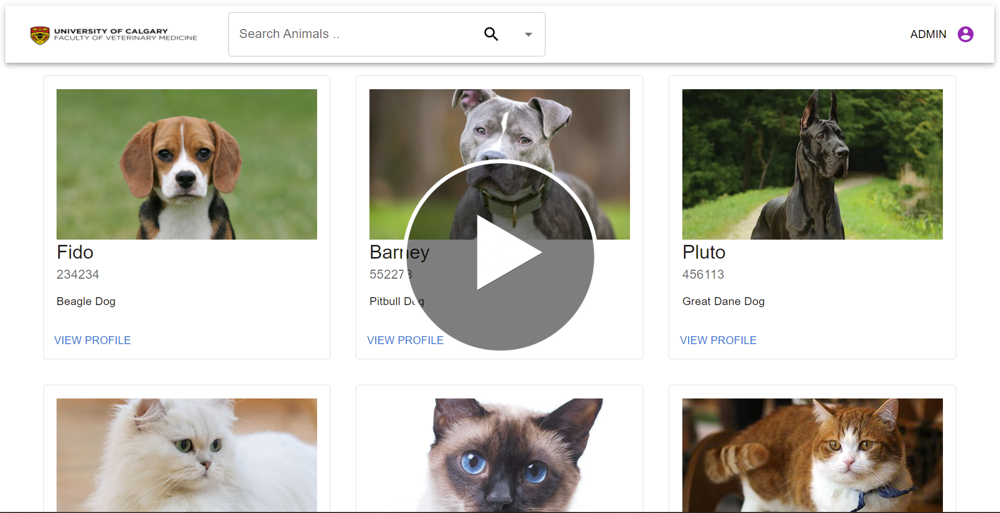

A web application for the school of Veterinary Medicine at the University of Calgary to help manage animals profiles, treatment & prescriptions, animal status availability for instruction purposes and process requests for treatment and instructions.
Functionality:

* Manage animals <br>
    a. Create animal profile (includes profilee photo, RFID number, name, sex, breed, age etc.)<br>
    b. Search animals<br>
    c. Ongoing care process (prescriptions, medications, treatment)<br>
    d. Leave comments and alerts on the animal profiles.

* User Management<br>
    a. Add users<br>
    b. Access control<br>
    c. Manage users (block, suspend, etc)<br>

## Demo Video
[](https://drive.google.com/file/d/10cGJ0PMyuE2LkDLikTEcwSY4hHY9A6Ce/view?usp=sharing)

## Database Instructions
1. Ensure that `dummyvet2.sql` has been loaded and executed in MySQL workbench.
2. In the Java IDE,  `navigate to > src > main > resources` and open `application.properties`.
3. In application.properties, change the following lines:
    ```spring.datasource.url=jdbc:mysql://localhost:3306/DUMMYVET2
    spring.datasource.username=root
    spring.datasource.password=password
    spring.jpa.hibernate.naming.implicit-strategy=org.hibernate.boot.model.naming.ImplicitNamingStrategyLegacyJpaImpl
    spring.jpa.hibernate.naming.physical-strategy=org.hibernate.boot.model.naming.PhysicalNamingStrategyStandardImpl

    spring.jpa.properties.hibernate.dialect= org.hibernate.dialect.MySQL5InnoDBDialect
    spring.jpa.hibernate.ddl-auto= update

    vet-app.app.jwtSecret= mySecretKey
    vet-app.app.jwtExpirationMs= 86400000
    
4. Navigate to `> src > main > java` and run  `Application.java`

---

## API endpoints
1. User story: VETAPP-11 Add Users
    * API endpoint (POST): http://localhost:8080/users
2. User story: VETAPP-13 Edit Users
    * API endpoint (PUT): http://localhost:8080/users
3. User story: VETAPP-12 Review Comments
    * API endpoint (GET): http://localhost:8080/animals/comments
    * API endpoint (GET): http://localhost:8080/animals/comments/{id}
    * API endpoint (PUT): http://localhost:8080/animals/comments/{id}
4. User story: VETAPP-15, VETAPP-25 Make/Take Comments
    * API endpoint (POST): http://localhost:8080/animals/comments
5. User story: VETAPP-19, VETAPP-28 View & Search
    * API endpoint (GET): http://localhost:8080/animals
    * API endpoint (GET): http://localhost:8080/animals/{id}
6. User story: VETAPP-100 View photos
    * API endpoint (GET): http://localhost:8080/animals/photos
    * API endpoint (GET): http://localhost:8080/animals/photos/{id}
7. User story: VETAPP-27, VETAPP-24 Monitor Animal Status
    * API endpoint (GET): http://localhost:8080/animals/status
    * API endpoint (GET): http://localhost:8080/animals/{id}
8. User story: VETAPP-17, VETAPP-18, VETAPP 23 Change/Update Animal Status
    * API endpoint (PUT): http://localhost:8080/animals/status
    * API endpoint (PUT): http://localhost:8080/animals/{id}
9. User story: VETAPP14 Upload Photos
    * API endpoint (POST): http://localhost:8080/animals/photos
    * API endpoint (POST): http://localhost:8080/animals/photos/{id}
10. User story: VETAPP18 Update Treatment
    * API endpoint (PUT): http://localhost:8080/animals/treatments/{id}
11. User story: VETAPP18 Diagnose & Prescribe Treatment
    * API endpoint (POST): http://localhost:8080/animals/prescriptions
    * API endpoint (PUT): http://localhost:8080/animals/prescriptions/{scriptRecord}
12. User story VETAPP-16 Request Treatment 
    * API endpoint(POST): http://localhost:8080/animals/prescriptions 
      (Note: When the user enters null values on a new prescriptions, it will be checked as a request for treatment) 

---
## Frontend 
Please ensure you have the following installed:

`npm install axios` <br>
`npm install @mui/material`<br>
`npm install @mui/x-data-grid`<br>
`npm install @mui/material`<br>
`npm install @mui/icons-material`<br>
`npm install @emotion/react`<br>
`npm install @emotion/styled`<br>
`npm i date-fns`<br>
`npm i @mui/lab`<br>
`npm install react-router-dom@5`<br>
`npm install react-router-dom@5`


Once all the dependencies have install, start the react application:
`npm start`

Implemented Features on the Front End

- Home Page
- Login Page
- Animal Profile Grid
- Users Management Page
- Animal Request Page
- Animal Profile Details Page
- Animal Images
- Animal Comments
- Animal Rx
- Animal Alerts
- Not Found Page
---


## Backend 
Back end is built using Spring Boot for database connectivity and Spring Security on the API end points.

### Instructions
- http://localhost:8080/ directs to backend home page - Spring Boot
- http://localhost:3000/ directs to login page - React App

### Example login credentials:
* **Admin Role**:<br>
    username: `admin` , password: `password`
* **Animal Care Attendent Role**:<br>
    username: `aca` , password: `password`
* **Animal Health Technician Role**:<br>
    username: `aht` , password: password
* **Student Role**:<br>
    username: `student` , password: `password`
* **Teaching Technician Role**:<br>
    username: `tt` , password: `password`


